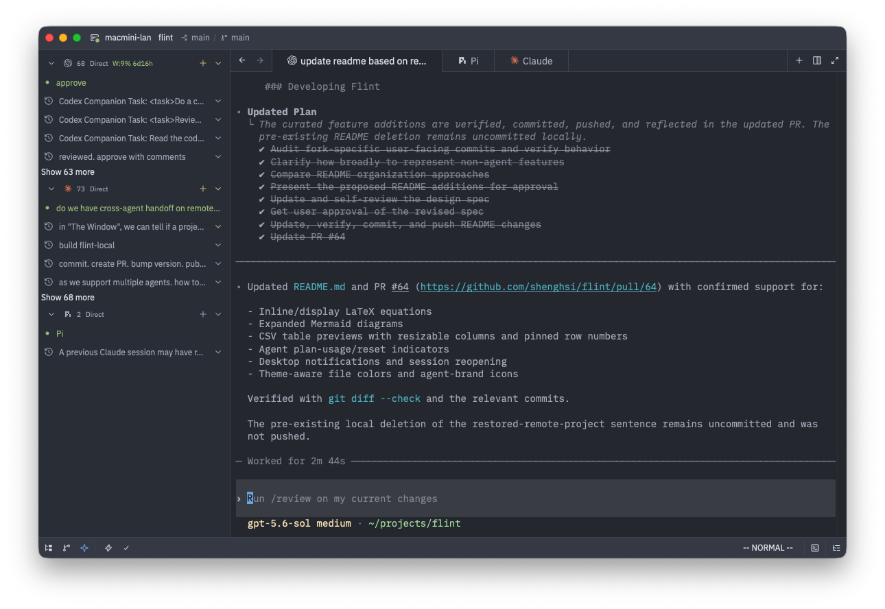
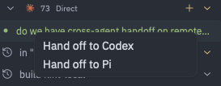

# Flint

Flint is a terminal-first fork of [Zed](https://github.com/zed-industries/zed) built for developers who use tools such as Codex, Claude Code, and Pi from the command line.

It keeps Zed's fast, GPU-accelerated editor, language support, Git tooling, and extension ecosystem while replacing the built-in AI product with a focused workspace for terminal-based coding agents.



## Why Flint?

Flint brings an IDE's editing and project tools together with the directness of a terminal-native workflow. Files, terminals, diffs, Git state, and long-running coding-agent sessions share one workspace, so you can delegate from the command line and review the result without moving between separate applications.

| | Flint | Conventional IDEs | Terminal emulators |
| --- | --- | --- | --- |
| Code intelligence and extensions | Built in | Built in | Added through command-line tools |
| Terminals as primary workspaces | Yes | Usually secondary panels | Yes |
| Persistent CLI agent sessions | Organized as threads alongside files and diffs | Often replaced by proprietary chat surfaces | Available, but managed as terminal tabs or windows |
| Git changes and visual diff review | Integrated | Integrated | Primarily command-line driven |
| Agent credentials and configuration | Uses your existing CLI setup | Often configured separately by the IDE | Uses your existing CLI setup |

Flint is for developers who want the project awareness and visual review tools of an IDE without giving up command-line agents, terminal workflows, or control of their local configuration.

### Added

- **First-class terminals:** New terminals open as tabs in the center workspace by default, alongside files and diffs.
- **Codex, Claude Code, and Pi threads:** Launch any supported CLI directly in a terminal-backed thread using its existing authentication and configuration.
- **Agent Threads panel:** Organize sessions, discover recent threads on the local machine or connected remote host, and resume work using titles from each agent's history.
- **Agent status and continuity:** See Codex and Claude Code plan usage and reset countdowns, receive desktop notifications when a thread needs attention, and optionally reopen resumable sessions after restarting Flint.
- **Cross-agent handoff:** Preview a bounded handoff document from a live local thread, then continue the work in a fresh thread with another supported agent.
- **Remote agent threads:** Run supported agents on SSH remotes using either the remote's configured CLI (`Direct`) or pinned Flint-managed binaries whose traffic is routed through local Flint (`Tunneled`).
- **Configurable agent workflows:** Set commands, arguments, environment variables, working directories, visibility, panel location, and default resume options.
- **Rich Markdown previews:** Render inline and display LaTeX equations through bundled MathJax when Node.js is available, plus expanded Mermaid diagram types and diagrams with YAML frontmatter.
- **CSV table previews:** Open saved `.csv` files as tables with independently resizable columns and a pinned row-number column.
- **Faster visual navigation and review:** Distinguish file types with theme-aware colors and agents with recognizable brand icons, then open project changes directly from the editor toolbar for review with Zed's Git and diff views.



### Removed

Flint does not ship Zed's native agent and chat interface, hosted AI models, model-provider configuration, Copilot or edit predictions, account and billing UI, or real-time collaboration and calls. The result is a smaller, local-first product surface that leaves agent behavior and credentials with the CLI tools you already use.

## Try Flint

Download the latest stable build for macOS, Linux, or Windows from [GitHub Releases](https://github.com/shenghsi/flint/releases/latest), or a preview build from the [Releases page](https://github.com/shenghsi/flint/releases) (preview builds are marked as pre-releases and ship ahead of stable).

### macOS

After moving Flint into `/Applications`, remove the quarantine attribute so macOS will allow the unsigned app to open:

```sh
xattr -cr /Applications/Flint.app
```

### Linux

Install Flint into `~/.local` (no root required, and in-app auto-update works):

```sh
curl -f https://raw.githubusercontent.com/shenghsi/flint/main/script/install.sh | sh
```

To install the preview channel instead of stable, set `ZED_CHANNEL=preview`:

```sh
curl -f https://raw.githubusercontent.com/shenghsi/flint/main/script/install.sh | ZED_CHANNEL=preview sh
```

This installs the app bundle alongside a stable install (as `~/.local/flint-preview.app`, which auto-updates only within the preview channel), but the `flint` command in `~/.local/bin` always points at whichever channel you installed most recently.

If `~/.local/bin` isn't already on your `PATH`, add it so you can launch Flint with `flint`.

The `.deb` and `.rpm` packages install Flint system-wide under `/usr/lib/flint`. Those builds are managed by your package manager, so in-app auto-update is disabled — update them with `apt`, `dnf`, etc.

### Remote Development

Flint supports SSH and WSL remote development while keeping the editor UI local. Files, terminals, tasks, language servers, and agent threads run on the remote host.

Remote agent threads can use either the remote host's own network (`Direct`) or a Flint-managed route (`Tunneled`). With `Tunneled`, Flint can provision pinned Codex, Claude Code, and Pi binaries on the remote host and route supported provider traffic back through the local Flint connection, which helps when a remote machine has restricted internet (VPN) access. Flint marks tunneled SSH projects in the title bar and project picker.

See [Remote Development](./docs/src/remote-development.md) for setup, SSH connection settings, port forwarding, and the `agent_route` option.

### Developing Flint

- [Building Flint for macOS](./docs/src/development/macos.md)
- [Building Flint for Linux](./docs/src/development/linux.md)
- [Building Flint for Windows](./docs/src/development/windows.md)

### Extensions

Flint is compatible with the [Zed extension registry](https://zed.dev/extensions). Extensions install and work without modification.

### Licensing

Flint source code is licensed primarily under GPL-3.0-or-later, with Apache-2.0 components where marked.

License information for third party dependencies must be correctly provided for CI to pass.

We use [`cargo-about`](https://github.com/EmbarkStudios/cargo-about) to automatically comply with open source licenses. If CI is failing, check the following:

- Is it showing a `no license specified` error for a crate you've created? If so, add `publish = false` under `[package]` in your crate's Cargo.toml.
- Is the error `failed to satisfy license requirements` for a dependency? If so, first determine what license the project has and whether this system is sufficient to comply with this license's requirements. If you're unsure, ask a lawyer. Once you've verified that this system is acceptable add the license's SPDX identifier to the `accepted` array in `script/licenses/flint-licenses.toml`.
- Is `cargo-about` unable to find the license for a dependency? If so, add a clarification field at the end of `script/licenses/flint-licenses.toml`, as specified in the [cargo-about book](https://embarkstudios.github.io/cargo-about/cli/generate/config.html#crate-configuration).

### Acknowledgements

Flint is built on top of [Zed](https://github.com/zed-industries/zed) by Zed Industries. We are grateful for their open-source contribution.
